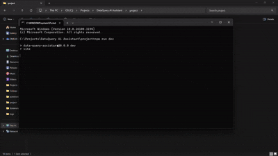
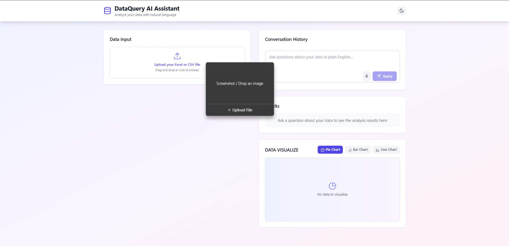
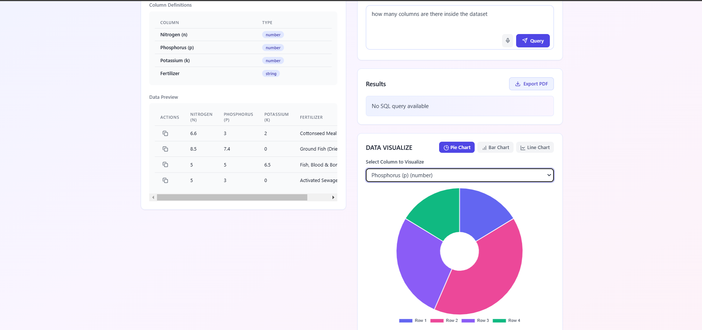
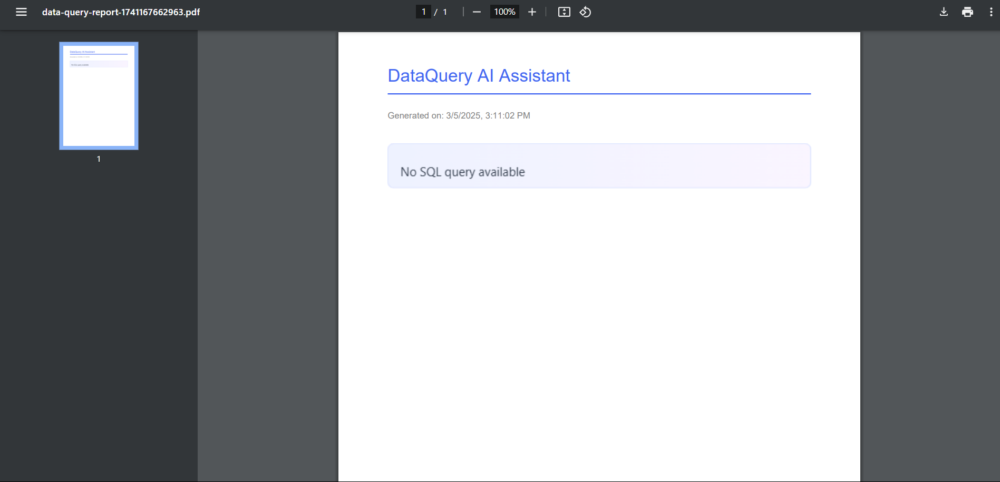

# DataQuery AI Assistant 🤖

A powerful data analysis and visualization tool that combines natural language processing with interactive data exploration. This application allows users to analyze their data using plain English queries and visualize the results through dynamic charts.

## 📸 Application Preview

Here's a quick look at the DataQuery AI Assistant in action:



## ✨ Features

### 1. Intuitive Data Upload 📊
- Support for CSV and Excel files
- Automatic schema detection
- Real-time data preview
- Dark/Light mode support

### 2. Natural Language Queries 💬
- Ask questions about your data in plain English
- Voice input support for queries
- Real-time query processing
- Conversation history tracking

### 3. Interactive Data Visualization 📈
- Multiple chart types:
  - Bar Charts
  - Pie Charts
  - Line Charts
- Dynamic data updates
- Column-specific visualizations
- Dark mode compatible charts

### 4. Voice Input Capabilities 🎤
- Real-time speech-to-text conversion
- Voice query support
- Visual feedback during recording
- Multiple language support

### 5. Advanced Data Analysis 📊
- Automatic data type detection
- Column-based analysis
- Distribution visualization
- Pattern recognition

### 6. Export Capabilities 📁
- Export analysis as PDF
- Copy row data to clipboard
- Save visualization results

## 🚀 Getting Started

### Prerequisites
- Node.js (v14 or higher)
- npm or yarn

### Installation

1. Clone the repository:
```bash
git clone https://github.com/yourusername/dataquery-ai-assistant.git
```

2. Navigate to the project directory:
```bash
cd dataquery-ai-assistant
```

3. Install dependencies:
```bash
npm install
# or
yarn install
```

4. Start the development server:
```bash
npm run dev
# or
yarn dev
```

5. Open your browser and visit `http://localhost:5173`

## 🎯 Usage

1. **Upload Data**
   - Click the upload area or drag and drop your CSV/Excel file
   - Preview your data in the table view
   

2. **Query Your Data**
   - Type your question in the query box
   - Or click the microphone icon to use voice input
   

3. **Visualize Results**
   - Select different chart types using the visualization controls
   - Choose specific columns to analyze
   - Toggle between dark and light modes
   

4. **Export Results**
   - Click the "Export PDF" button to save your analysis
   - Use copy buttons to copy specific data rows
   

## 🛠️ Technologies Used

- **Frontend Framework**: React with TypeScript
- **Styling**: Tailwind CSS
- **Charts**: Chart.js with react-chartjs-2
- **File Processing**: xlsx
- **PDF Export**: jspdf, html2canvas
- **Voice Input**: Web Speech API
- **Icons**: Lucide React

## 📝 Contributing

1. Fork the repository
2. Create your feature branch (`git checkout -b feature/AmazingFeature`)
3. Commit your changes (`git commit -m 'Add some AmazingFeature'`)
4. Push to the branch (`git push origin feature/AmazingFeature`)
5. Open a Pull Request

## 📜 License

This project is licensed under the MIT License - see the [LICENSE](LICENSE) file for details.

## 🙏 Acknowledgments

- Chart.js for the visualization library
- Tailwind CSS for the styling framework
- The React community for amazing tools and support

